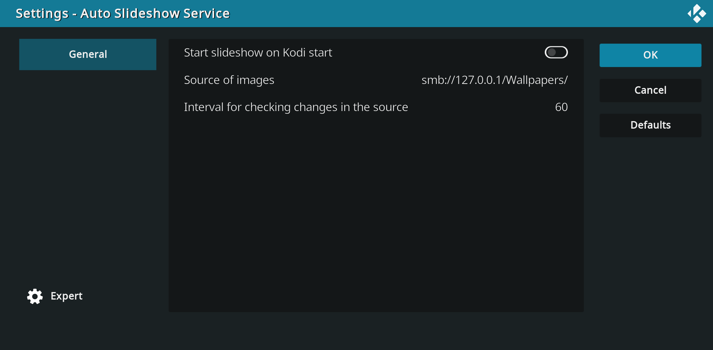
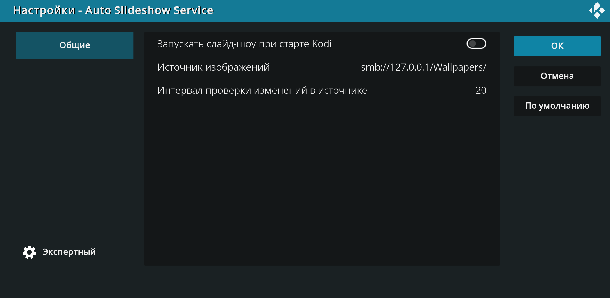

# service.autoslideshow

This addon works either as a service and can automatically start slideshow on Kodi startup or it works as a program addon and slideshow can be started manually. Addon also detects changes in source directory and restarts slideshow. When restarting, if possible the slideshow starts from the last file shown. Sub directories are supported.

## Credits

Based on script written by ashtonaut: https://discourse.osmc.tv/t/refresh-picture-library/4867/13

[Icon by Freepik](https://www.freepik.com/icon/images_3308916)

## Screenshots

